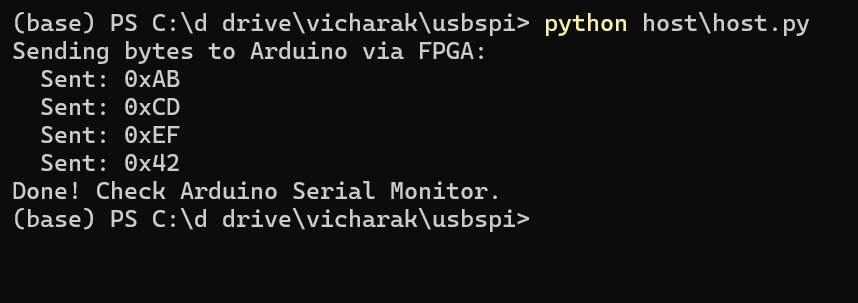
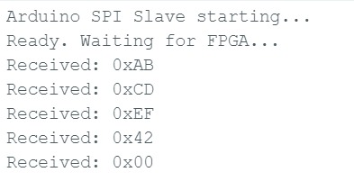

# USB-to-SPI Bridge

**Difficulty:** Intermediate

**Uses MCU:** Yes

**External Hardware:** Arduino Uno (or any SPI slave MCU), jumper wires, breadboard

## Overview

A full USB-to-SPI bridge using the Shrike-Lite board. Data flows from a PC terminal over USB to the RP2040, which forwards it via SPI to the FPGA. The FPGA acts as an SPI slave on one side and an SPI master on the other, relaying each byte to an external Arduino acting as a second SPI slave. This demonstrates bidirectional SPI bridging across the FPGA fabric.

```
PC (USB) ──> RP2040 (SPI Master) ──> FPGA (Slave → Master) ──> Arduino (SPI Slave)
```

## Compatibility

| Board                | Status      |
| -------------------- | ----------- |
| Shrike-Lite (RP2040) | ✅ Tested    |
| Shrike (RP2350)      | ⬜ Untested  |
| Shrike-fi (ESP32-S3) | ⬜ Untested  |

> FPGA bitstream is the same across all boards.

### Wiring

Connect the FPGA master-side SPI outputs to the Arduino SPI slave pins:

| FPGA Signal | FPGA GPIO | Arduino Pin | Wire Color (photo) |
| ----------- | --------- | ----------- | ------------------ |
| m_sck       | GPIO8     | SCK (13)    | Blue               |
| m_mosi      | GPIO9     | MOSI (11)   | Orange             |
| m_ss_n      | GPIO10    | SS (10)     | Black              |
| m_miso      | GPIO15    | MISO (12)   | Orange             |
| GND         | GND       | GND         | Black              |

> **Note:** The RP2040-to-FPGA SPI link uses the fixed Shrike-Lite pins (SCK=GP2, CS=GP1, MOSI=GP3, MISO=GP0) and requires no external wiring.

### Level Shifting

The FPGA GPIOs on the Shrike-Lite run at 3.3V. The Arduino Uno runs at 5V but its SPI pins accept 3.3V logic as HIGH, so direct wiring works for most cases. For reliable operation, use a 3.3V-to-5V level shifter on the MISO line (Arduino → FPGA) or use resistive voltage dividers.

## Quick Start (Pre-Built Bitstream)

1. Connect the Shrike-Lite to your PC via USB
2. Flash the FPGA bitstream:
   - Copy `bitstream/usbspi.bin` to the RP2040 storage
   - The MicroPython firmware calls `shrike.flash("usbspi.bin")` on boot
3. Wire the Arduino to the FPGA master-side SPI pins (see table above)
4. Upload `firmware/arduino/spi_slave.ino` to the Arduino
5. Run the host script:
   ```bash
   pip install pyserial
   python firmware/micropython/host.py
   ```
6. Open the Arduino Serial Monitor at 115200 baud to see received bytes

### Expected Output

**Host terminal (PC side):**



**Arduino Serial Monitor:**



## Build From Source

### FPGA (Verilog)

1. Open `usbspi.ffpga` in [Go Configure Software Hub](https://www.renesas.com/en/software-tool/go-configure-software-hub)
2. Verilog sources are in `ffpga/src/`
3. Click **Generate Bitstream**
4. The output `.bin` goes into `bitstream/`

### Firmware

**RP2040 (MicroPython):**

1. Flash MicroPython onto the RP2040 (if not already done)
2. Copy `firmware/micropython/main_usb.py` to the board as `main.py`
3. Place `bitstream/usbspi.bin` on the board storage as `usbspi.bin`
4. The board will flash the FPGA and start the USB-SPI bridge on boot

**Arduino:**

1. Open `firmware/arduino/spi_slave.ino` in Arduino IDE
2. Select your board (Arduino Uno) and COM port
3. Upload

## How It Works

### Data Path

1. **PC → RP2040:** The host script (`host.py`) sends bytes over USB serial using `pyserial`
2. **RP2040 → FPGA:** The RP2040 acts as SPI master on the fixed Shrike link pins, sending each byte and reading the FPGA's MISO response
3. **FPGA bridging:** The FPGA contains an SPI slave (`spi_target`) that receives from the RP2040 and an SPI master that forwards each byte out to the external MCU
4. **FPGA → Arduino:** The SPI master drives SCK, MOSI, and CS to the Arduino, which runs an interrupt-driven SPI slave and prints each received byte

### FPGA Design

The Verilog design has three modules:

| Module       | File             | Role                                           |
| ------------ | ---------------- | ---------------------------------------------- |
| `top`        | `top.v`          | Glue logic — connects slave RX to master TX    |
| `spi_target` | `spi_target.v`   | SPI slave — receives from RP2040               |
| `spi_master` | `top.v`          | SPI master — forwards to external MCU          |
| `echo_test`  | `echo_test.v`    | Standalone echo test (slave-only, for debug)    |

### Pin Mapping (FPGA)

| Signal      | Direction | FPGA GPIO | Connected To         |
| ----------- | --------- | --------- | -------------------- |
| spi_sck     | Input     | GPIO4     | RP2040 GP2 (fixed)   |
| spi_ss_n    | Input     | GPIO3     | RP2040 GP1 (fixed)   |
| spi_mosi    | Input     | GPIO5     | RP2040 GP3 (fixed)   |
| spi_miso    | Output    | GPIO6     | RP2040 GP0 (fixed)   |
| m_sck       | Output    | GPIO8     | External MCU SCK     |
| m_mosi      | Output    | GPIO9     | External MCU MOSI    |
| m_ss_n      | Output    | GPIO10    | External MCU SS      |
| m_miso      | Input     | GPIO15    | External MCU MISO    |
| led         | Output    | GPIO16    | Onboard LED          |

## Extra Scripts

- `firmware/micropython/finalusb.py` — Standalone SPI loopback test that runs directly on the RP2040. Sends a few bytes over SPI and checks that the FPGA echoes them back correctly. Useful for verifying the FPGA bitstream without a PC host connection.
